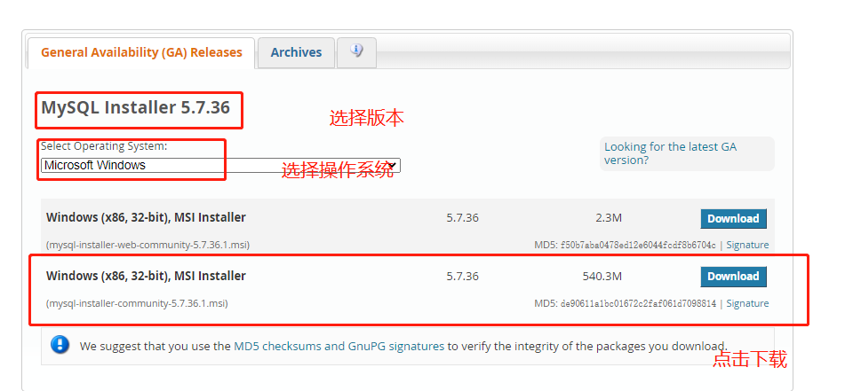
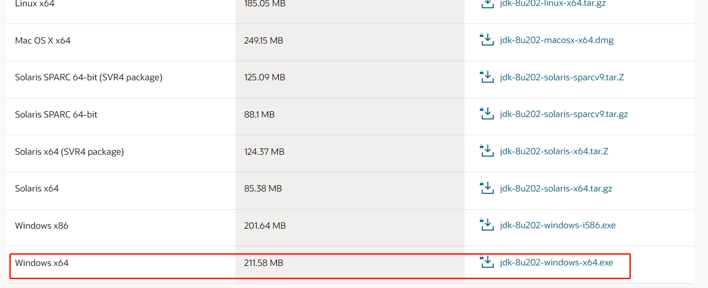

**项目部署文档**

# 1 运行演示项目

## 1.1 安装MySQL数据库

### 1.1.1 直接官网下载:

https://dev.mysql.com/downloads/installer/

**注意: 下载的时候,需要先注册oracle账户**

### 1.1.2 安装MySQL数据库

### 1.1.3 安装MySQL客户端连接

### 1.1.4 配置数据库的编码为utf8

## 1.2 配置Java环境

### 1.2.1 直接官网下载

**注意: 下载的时候,需要先注册oracle账户**

https://www.oracle.com/java/technologies/javase/javase8-archive-downloads.html

### 1.2.2 配置Java环境变量(JAVA_HOME和PATH)

## 1.3 运行演示项目

### 1.3.1 导入数据库文件

### 1.3.2 启动wms项目(startup.bat)

# 2 运行Selenium的自动化框架

## 2.1 配置Python环境(配置webdriver驱动)

## 2.2 把项目使用IDEA工具打开

## 2.3 配置虚拟环境

## 2.4 安装对应的依赖

## 2.5 运行项目注意的事项

### 2.5.1 配置登录的cookie信息

### 2.5.2 配置对应的图片上传路径

### 2.5.3 生成allure报告并且打开报告

