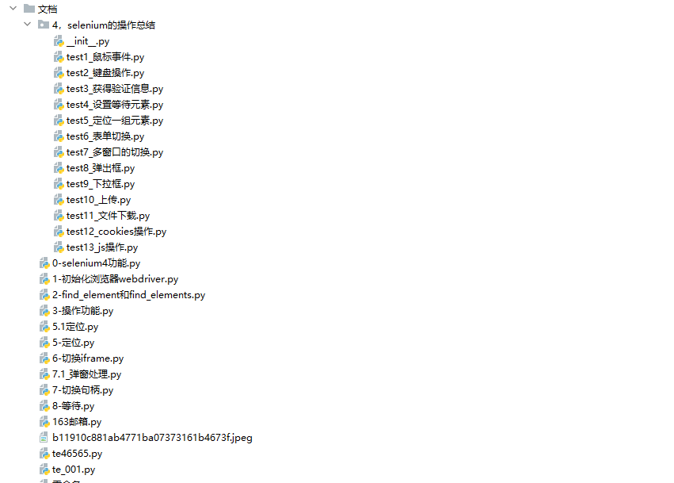

# web自动化测试框架 pytest-allure-selenium-po-demo

#### 介绍
web自动化测试框架 pytest-allure-selenium-po-demo

#### 软件架构
采用PO模型设计思路+pytest测试框架allure展示测试报告

```log
├─base          #base基本操作类，selenium  二次封装
├─business      #做业务测试
│  ├─func_all   # 业务1  *_page.py 为页面元素定位， *_bs.py为业务操作，*_assert.py 断言方法
│  ├─new_task   #业务2   *_page.py 为页面元素定位， *_bs.py为业务操作，*_assert.py 断言方法
├─common        #公共方法 
├─config        #配置文件
│  ├─pre        #正式环境数据
│  └─test       #测试环境数据
├─images        #录屏文件存放
├─log           #日志
├─png           #截图
├─test_func     # 业务1 测试用例
├─test_risk     # 业务2 测试用例
└─文档
    └─4，selenium的操作总结
```


#### 安装教程

1.  安装依赖环境 pip install -r requirements.txt -i http://pypi.douban.com/simple/ --trusted-host pypi.douban.com
2.  安装allrue报告allure-2.xx.xx.zip
3.  安装java环境，allure需要java环境

#### 使用说明

1.  实现封装了iframe切换，句柄切换，非Input标签上传等等操作
2.  采用PO模型设计思路+pytest测试框架allure展示测试报告
3.  相关文档   
    
4. 测试报告   
    
    
    
    
    

            

#### 参与贡献
QQ/微信 ：397135766   


     
如群码过期加微信备注“加群”


#### 特技

